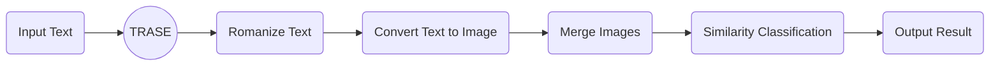

# D. PROJECT EXECUTION
**Project Design:**

```mermaid
graph LR
A(Input Text) --> B((TRASE))
B --> C(Romanize Text)
C --> D(Convert Text to Image)
D --> E(Merge Images)
E --> F(Similarity Classification)
F --> G(Output Result)
```
**Code Snippets:**

